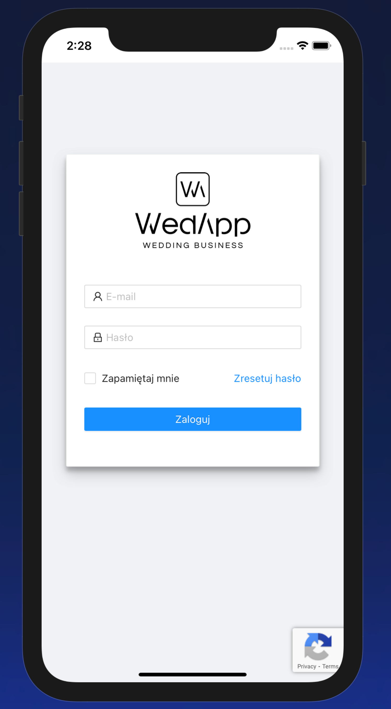

# WedApp - iOS Client
>  It's a porting in iOS APP, working Web Application. 

## Table of contents
* [General info](#general-info)
* [Screenshots](#screenshots)
* [Technologies](#technologies)
* [Setup](#setup)
* [Features](#features)
* [Status](#status)
* [Inspiration](#inspiration)
* [Contact](#contact)

## General info

In this project i had use WebKit framework to port in iOS our's company aplication, for Wedding manegment.

## Screenshots

## Technologies
* Tech 1 - version 1.0

## Setup
Import to Xcode and Simulate on your Device. 

## Code Examples
`nil-at-the-moment` :)

## Features
TODOs for future development:
* Internet Connection status

## Status
Project is: _in progress

## Inspiration
Author Conception

## Contact
Created by mail agaisab@gmail.com feel free to contact me!
